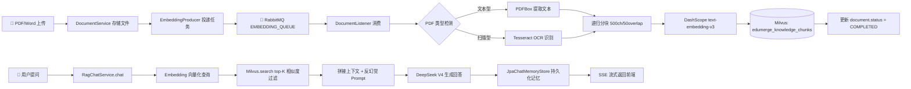
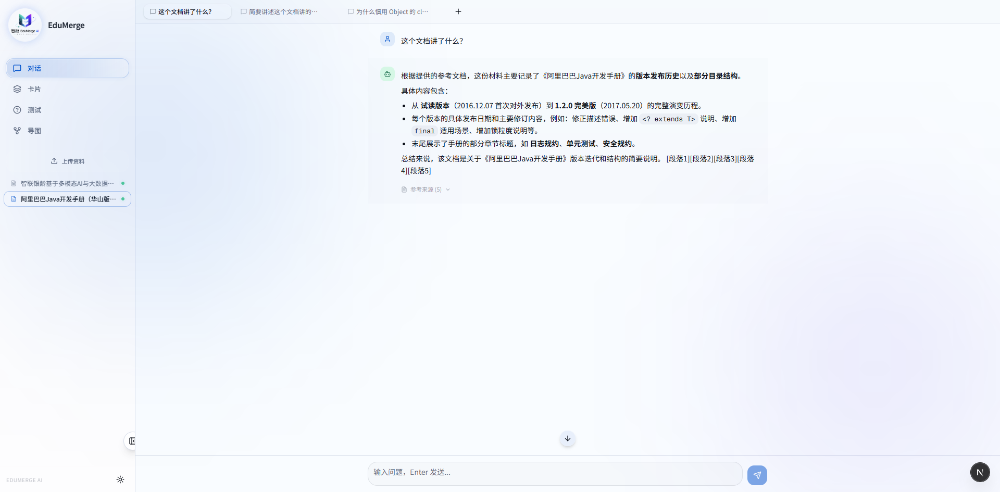
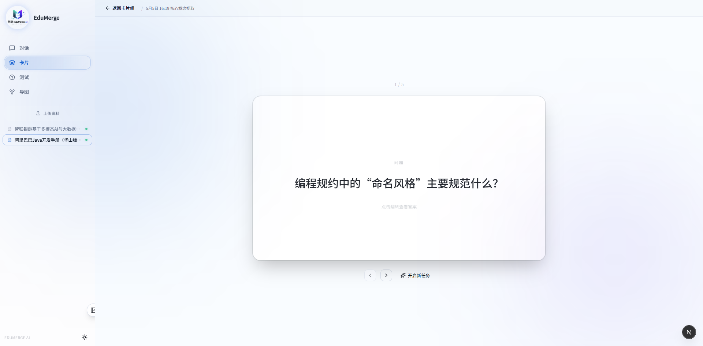
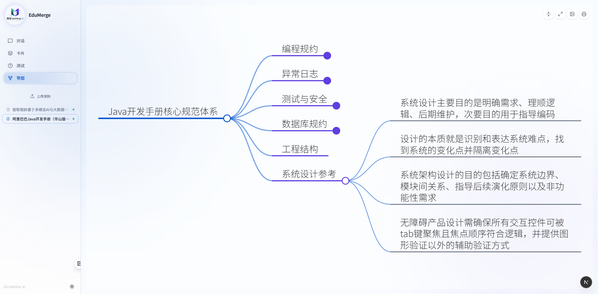
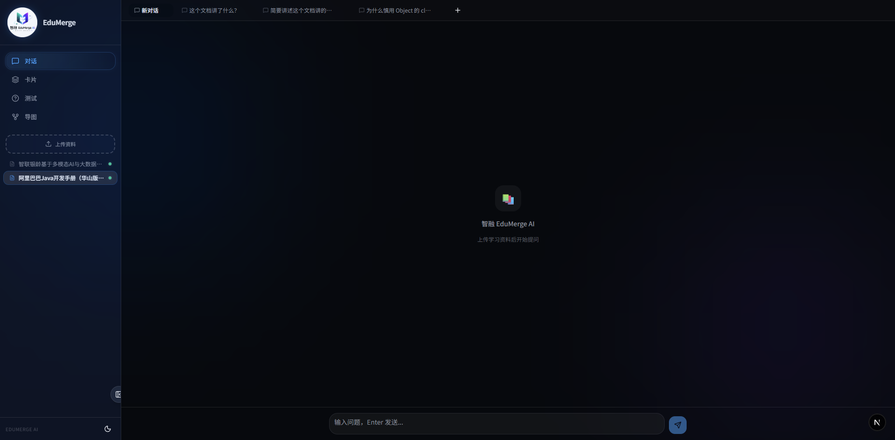

<p align="center">
  
</p>

<h1 align="center">智融 EduMerge</h1>

<p align="center">
  <strong>AI 学习伴侣 &mdash; 将碎片化文档转化为系统性知识体系</strong>
</p>

<p align="center">
  <a href="https://spring.io/projects/spring-boot"></a>
  <a href="https://nextjs.org/"></a>
  <a href="https://milvus.io/"></a>
  <a href="https://docs.langchain4j.dev/"></a>
  <a href="https://www.deepseek.com/"></a>
  <a href="https://www.rabbitmq.com/"></a>
  <a href="#license"></a>
  <a href="https://github.com/2943331378/EduMerge"></a>
</p>

---

## 目录

- [📖 项目简介](#-项目简介)
- [✨ 核心功能](#-核心功能)
- [🏗️ 架构设计](#️-架构设计)
- [🚀 快速开始](#-快速开始)
- [📸 界面预览](#-界面预览)
- [🤝 团队与贡献](#-团队与贡献)

---

## 📖 项目简介

**信息过载** 是每个深度学习者都会遭遇的困境：几十页的论文、上百页的教材、长篇的技术文档&mdash;&mdash;读完就忘，检索低效，知识点在脑海中始终碎片化。

**智融 EduMerge** 是一款集成了 **多智能体交互** 与 **RAG（检索增强生成）** 技术的智能知识管理平台。它不只是一个"文档问答机器人"&mdash;&mdash;它能将你上传的 PDF、Word 等非结构化文档，经由 AI 代理自动解构为：

- 一个 **永不遗忘的上下文记忆中枢**（持久化 Chat Memory，随时接续对话）
- 一组 **高颗粒度的知识卡片**（AI 自动提取核心概念 Q&A）
- 一张 **可交互的全景思维导图**（Markdown 层级树 + 动态 SVG 渲染）

**数据汲取 &rarr; 知识解构 &rarr; 结构化记忆** &mdash;&mdash; 这是 EduMerge 为你重塑的学习全链路。

---

## ✨ 核心功能

### 1. 基于 RAG 的文档级对话

不只是"上传 PDF 问问题"。EduMerge 构建了一套完整的 **RAG 检索增强生成管道**：

- **异步向量化管道**：文档上传后，经由 RabbitMQ 异步触发 PDFBox/OCR 文本提取 &rarr; 递归分块（500 字符 / 50 重叠）&rarr; DashScope 嵌入向量化 &rarr; Milvus 持久存储
- **上下文记忆中枢**：基于 MySQL 持久化 `ChatMemory`，对话历史可跨 Session 续接，突破大模型无状态限制
- **反幻觉系统提示**：每次检索结果拼装时注入 `"仅基于参考文献回答，无法回答请明确告知"` 的约束 Prompt

### 2. 智能抽卡引擎 (Deck System)

以 **Card Deck** 为分组容器，实现了 AI 驱动的知识颗粒度提取与数据分层治理：

- **卡片组 (Flashcard)**：AI 自动从文档中提取核心概念 Q&A，带 `source_segment` 字段实现内容溯源
- **测试题组 (Quiz)**：AI 自动生成单选/多选/判断题，`options` 以 JSON 格式存储，题目可追溯到原文
- **数据可追溯性**：每张卡片、每道题目均保留 `source_segment`&mdash;&mdash;记录该知识点源自文档的哪个片段

### 3. 一键思维大纲生成

体现 **"非结构化数据 &rarr; 结构化知识"** 转化的核心能力：

- **AI 层级提取**：Prompt 工程驱动 DeepSeek 模型从 Milvus 检索的 top-20 文本块中提取层级结构
- **Markdown 树状图**：输出严格的 `#` / `##` / `###` / `-` 四级 Markdown 格式
- **markmap 动态渲染**：前端基于 markmap-lib + markmap-view 将 Markdown 渲染为可交互的 SVG 思维导图
- **一键导出**：支持 PNG（2x 高清位图导出）和 PDF（浏览器打印）两种格式

### 4. 现代极简交互

- **毛玻璃 UI (Glassmorphism)**：Tailwind CSS 驱动的半透明材质 + 背景模糊 backdrop-blur
- **侧边栏文档管理**：折叠式侧边栏，上传/切换文档一体化
- **主题切换**：明暗双主题，OKLCH 色彩空间品牌色

---

## 🏗️ 架构设计

### 整体系统架构

```
┌──────────────────────────────────────────────────────────────────┐
│                         Frontend (Next.js)                        │
│  ┌──────────┐ ┌──────────┐ ┌───────────┐ ┌───────────────────┐  │
│  │ ChatRoom │ │Flashcard │ │ QuizView  │ │  MindMapViewer    │  │
│  │ (SSE流)  │ │  View    │ │           │ │ (markmap SVG)     │  │
│  └────┬─────┘ └────┬─────┘ └─────┬─────┘ └────────┬──────────┘  │
│       │             │             │                 │             │
│       └─────────────┴─────────────┴─────────────────┘             │
│                         │ HTTP/REST + SSE                         │
└─────────────────────────┼────────────────────────────────────────┘
                          │
┌─────────────────────────┼────────────────────────────────────────┐
│                 Backend (Spring Boot)                /api          │
│                         │                                         │
│  ┌──────────────────────┴──────────────────────────────────┐     │
│  │                   Controller Layer                       │     │
│  │  RagChatController  DeckController  MindMapController    │     │
│  │  LearningChatController  FlashcardController  ...        │     │
│  └──────────────────────┬──────────────────────────────────┘     │
│                         │                                         │
│  ┌──────────────────────┴──────────────────────────────────┐     │
│  │                    Service Layer                          │     │
│  │  AiRagService  AiMindMapGenerator  AiFlashcardGenerator  │     │
│  │  ConversationService  ChatHistoryService  SessionService │     │
│  └──────────────────────┬──────────────────────────────────┘     │
│                         │                                         │
│  ┌──────────────────────┴──────────────────────────────────┐     │
│  │            AI & Data Infrastructure                      │     │
│  │  ┌──────────────┐  ┌──────────────┐  ┌──────────────┐   │     │
│  │  │ LangChain4j  │  │Milvus SDK    │  │ MyBatis-Plus │   │     │
│  │  │ (LLM/Embed)  │  │ (向量检索)    │  │ (关系持久化) │   │     │
│  │  └──────┬───────┘  └──────┬───────┘  └──────┬───────┘   │     │
│  └─────────┼─────────────────┼─────────────────┼───────────┘     │
└────────────┼─────────────────┼─────────────────┼─────────────────┘
             │                 │                 │
             ▼                 ▼                 ▼
      ┌──────────┐   ┌──────────────┐   ┌───────────┐
      │ DeepSeek │   │    Milvus    │   │   MySQL   │
      │   V4     │   │ (向量数据库)  │   │  + Redis  │
      └──────────┘   └──────────────┘   └───────────┘
```

### RAG 数据处理管道 (Data Pipeline)



### 多智能体协同机制

EduMerge 不是单一大模型调用。系统中的 **三个 AI Generator** 各司其职，共享同一套 Milvus 向量检索基础设施，形成了事实上的"多智能体协同"：

| 智能体 | 核心职责 | 数据流向 |
|---|---|---|
| **AiRagService** | 文档对话代理：基于检索上下文回答用户自由提问 | Milvus &rarr; Prompt拼装 &rarr; DeepSeek &rarr; SSE流 |
| **AiFlashcardGenerator** | 知识卡片生成代理：提取核心概念 Q&A 对 | Milvus top-15 &rarr; Prompt约束 &rarr; 结构化JSON |
| **AiMindMapGenerator** | 思维导图生成代理：提取层级结构 Markdown 树 | Milvus top-20 &rarr; Prompt约束 &rarr; Markdown |

三者均继承 `AiGeneratorBase`，复用 `retrieveTopChunks()`、`buildContextWithPages()` 等检索基类方法，同时各自实现独立的 Prompt 模板和解析逻辑&mdash;&mdash;遵循 **"单一职责、共享基础设施"** 的架构原则。

---

## 🚀 快速开始

### 环境要求

| 组件 | 版本 | 说明 |
|---|---|---|
| Java | 17+ | 后端运行环境 |
| Maven | 3.6+ | 后端构建 |
| Node.js | 20+ | 前端开发环境 |
| MySQL | 8.0+ | 关系数据库 |
| Redis | 7.0+ | 缓存 & Session |
| RabbitMQ | 3.x | 异步消息队列 |
| Milvus | 2.4+ | 向量数据库 |

### 1. 克隆项目

```bash
git clone https://github.com/2943331378/EduMerge.git
cd EduMerge
```

### 2. 配置环境变量

在启动前，必须配置以下环境变量：

```bash
# DeepSeek API Key (Chat 模型)
export DEEPSEEK_API_KEY="sk-your-deepseek-key"

# DashScope API Key (Embedding 向量化模型 — DeepSeek 不支持 Embedding)
export AI_API_KEY="sk-your-dashscope-key"
```

> 这两项配置对应 `application.yml` 中的 `${DEEPSEEK_API_KEY}` 和 `${AI_API_KEY}` 占位符。

### 3. 初始化数据库

确保 MySQL 运行后，启动应用时将自动执行 `schema.sql`：

```bash
mysql -u root -p < backend/src/main/resources/db/schema.sql
```

或者直接启动后端，Spring Boot 的 `spring.sql.init.mode: always` 会自动建表。

### 4. 启动中间件

确保以下服务已启动：

```bash
# MySQL
mysqld

# Redis
redis-server

# RabbitMQ
rabbitmq-server

# Milvus (Docker 推荐)
docker run -d --name milvus-standalone \
  -p 19530:19530 -p 9091:9091 \
  milvusdb/milvus:2.4.4
```

### 5. 启动后端

```bash
cd backend

# 构建（必须分两步，Windows 下合并执行会导致资源打包竞态）
mvn clean
mvn package -DskipTests

# 启动
java -Dfile.encoding=UTF-8 -jar target/edumerge-backend-1.0.0.jar
```

后端启动后，API 服务默认访问地址：`http://localhost:8080/api`

### 6. 启动前端

```bash
cd frontend
npm install
npm run dev
```

前端开发服务器默认访问地址：`http://localhost:3000`

---

## 📸 界面预览

### 文档对话 (RAG Chat)


> *基于文档上下文的沉浸式对话，SSE 流式响应，持久化记忆*

### 知识卡片 (Flashcards)


> *AI 自动提取核心概念 Q&A，可追溯原文出处*

### 思维导图 (Mind Map)


> *一键生成全景思维大纲，支持交互式节点折叠与 PNG/PDF 导出*

### 深色主题


> *毛玻璃 Glassmorphism 风格，明暗双主题，OKLCH 品牌色*

---

## 🤝 团队与贡献

本项目目前为个人全栈开发项目（[2943331378](https://github.com/2943331378)），旨在探索 **AI 驱动教育科技** 的技术边界。

欢迎任何形式的贡献！如果你有好的想法或发现了 Bug：

1. Fork 本项目
2. 创建特性分支 (`git checkout -b feature/amazing-feature`)
3. 提交你的修改 (`git commit -m 'feat: add amazing feature'`)
4. 推送到远程分支 (`git push origin feature/amazing-feature`)
5. 发起 Pull Request

**Commit 规范**：请遵循 [Conventional Commits](https://www.conventionalcommits.org/) (`feat:`, `fix:`, `chore:`, `docs:`, `refactor:` 等)。

### 开源许可证

本项目采用 [MIT License](LICENSE) 开源。

---

<p align="center">
  <sub>Made with ❤️ by <a href="https://github.com/2943331378">EduMerge Team</a> &mdash; 让知识不再碎片化</sub>
</p>
